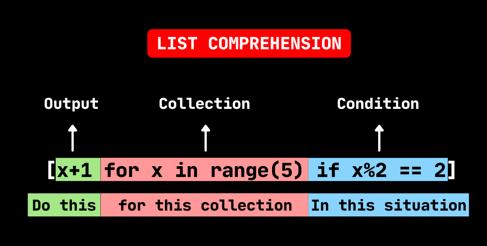

# Python concepts for data science: list comprehension

This project is part of the **Data Scientist program** offered by [Data Insight](www.datainsightonline.com).

Here, I describe the basic structure of a list comprehension first, then talk about the different categories of list comprehensions with increasing complexity. 
Each category is accompanied by a clear example and its equivalent using conventional *for loops* and *if...else* statements.

For The first three categories, we cevaluate the execution time to prove that list comprehension is faster than its equivalent **for loop**.
